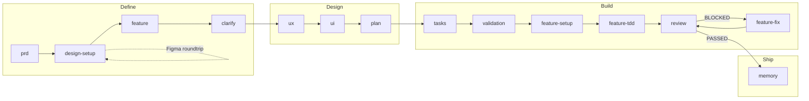

<p align="center">
  
</p>

<h1 align="center">MVP Builder</h1>

<p align="center">
  <strong>Build MVPs with AI — without the half-built mess.</strong><br>
  Document-Driven Development for Claude Code: specs before code, TDD enforced, self-review catches stubs.
</p>

<p align="center">
  <a href="#quickstart">Quickstart</a> •
  <a href="#what-sets-it-apart">What sets it apart</a> •
  <a href="#how-it-works">How it works</a>
</p>

---

## The Problem

AI coding agents are brilliant but unreliable:

- 🎭 **They hallucinate** — write code that "looks right" but doesn't work
- 🦥 **They cut corners** — stubs, mocks, "TODO: implement later"
- 🧠 **They forget** — lose context between sessions
- ✅ **They lie** — say "done" when work is half-finished

You end up debugging AI's mistakes instead of building your product.

---

## What sets it apart

> If the agent performs poorly, the task description is lacking.

The fix is not better prompts. It is **Document-Driven Development** — structured specifications that generate code, with verifiable outputs at every step.

**Specs that map to tests, not vibes.** Every feature is structured: `FR-XXX → TEST-XXX → IMPL-XXX → CHK → REV`. Skipping a step is detectable, not deniable.

**Self-review with a fix loop.** `/docs:review` produces `feedback.md` with concrete findings. `feature-fix` resolves them one at a time. `AICODE-*` markers track what is resolved across sessions — context resets do not erase progress.

**TDD enforced, not suggested.** Build phase runs RED-GREEN cycles. Tests come first, implementation follows, atomic commits keep the diff readable. The agent cannot ship a stub — the test would fail.

**Rules + Skills + Agents.** Extend by adding files, not rewriting agents. New language → drop a rule in `.claude/rules/`. New domain → drop a skill in `.claude/skills/`. Agents stay the same.

---

## Quickstart

In your project directory:

**macOS, Linux, WSL:**

```bash
curl -fsSL https://raw.githubusercontent.com/app-builders-club/mvp-builder/main/scripts/install.sh | bash
```

**Windows PowerShell:**

```powershell
irm https://raw.githubusercontent.com/app-builders-club/mvp-builder/main/scripts/install.ps1 | iex
```

This installs:
- `.claude/` — commands, agents, skills, rules
- `CLAUDE.md` — agent identity and execution rules
- `.mcp.json` — MCP server configuration

Then in Claude Code:

```
/docs:prd
```

That is it. The PRD command interviews you on product, audience, and core problem, then generates `PRD.md` and a `references/` folder you can populate with design systems, schemas, and screenshots. The pipeline takes you from there.

---

## How it works

### Pipeline



### Phase 1: Define

Transform product idea into structured specifications.

| Command / Agent | Output | Purpose |
|---------|--------|---------|
| `/docs:prd` | `PRD.md`, `references/` dir | Product vision, audience, core problem |
| `design-setup` | `references/design-system.md`, `tokens/`, `style-guide.md` | Normalize design references, extract from Figma |
| `/docs:feature` | `spec.md`, `FEATURES.md` | Feature specs with requirements (FR-XXX, UX-XXX) |
| `/docs:clarify` | Updated `spec.md` | Resolve ambiguities through targeted questions |

**After `/docs:prd`**: Add supplementary materials to `ai-docs/references/` — design systems, tokens, schemas, API contracts, style guides, screenshots. Run `design-setup` agent to normalize raw generator output.

**Figma roundtrip** (optional): Run `design-setup [figma-url]` to extract tokens and screens from Figma. Refine in Figma, then re-run `design-setup [figma-url]` to pull changes back. Repeat until design is locked.

### Phase 2: Design

Convert specifications into technical architecture.

| Command | Output | Purpose |
|---------|--------|---------|
| `/docs:ux` | `ux.md` | User flows, states, error handling, accessibility |
| `/docs:ui` | `ui.md` | Component trees, DS mapping, layout structure |
| `/docs:plan` | `plan.md`, `data-model.md`, `contracts/`, `setup.md` | Architecture, entities, API specs, environment |

### Phase 3: Build

Execute implementation through TDD cycles with self-verification.

| Command / Agent | Output | Purpose |
|-----------------|--------|---------|
| `/docs:tasks` | `tasks.md` | INIT tasks + TDD cycles (TEST-XXX → IMPL-XXX) |
| `/docs:validation` | `validation/*.md` | Checklists with traceable checkpoints (CHK) |
| `feature-setup` | Infrastructure code | Execute INIT tasks, scaffold project |
| `feature-tdd` | Feature code + tests | RED-GREEN cycles, atomic commits |
| `/docs:review` | `feedback.md` | Verify implementation, generate findings (REV-XXX) |
| `feature-fix` | Fixed code | Apply fixes one error at a time |

**Review Loop**: If review status is BLOCKED → `feature-fix` → `/docs:review` → repeat until PASSED.

### Phase 4: Ship

Finalize and document completed implementation.

| Command | Output | Purpose |
|---------|--------|---------|
| `/docs:memory [feature-path]` | `ai-docs/README.md` | Add feature to code map, rebuild dependency graph |
| `/docs:memory` | `ai-docs/README.md` | Rescan entire project, capture all changes |

**Two modes**: with feature path — adds the feature entry and rebuilds the graph. Without arguments — full project rescan for changes made outside feature scope (refactoring, new shared modules, deleted files). Feature list is preserved, only the dependency graph is rebuilt from scratch.

### Agents

Specialized agents execute tasks across pipeline phases:

**Define phase:**

| Agent | Role | When to use |
|-------|------|-------------|
| `design-setup` | Normalize design references, extract Figma | When user adds design references to `ai-docs/references/` or provides a Figma URL |

**Build phase:**

| Agent | Role | When to use |
|-------|------|-------------|
| `feature-setup` | Scaffold infrastructure | After `/docs:validation`, executes INIT-XXX tasks |
| `feature-tdd` | TDD implementation | After setup, runs RED-GREEN cycles |
| `feature-fix` | Apply review fixes | When review status = BLOCKED, fixes one error at a time |

### Rules & Skills

**Rules** (`.claude/rules/`) are always-loaded standards — loaded automatically like `CLAUDE.md`. Platform-specific rules use `paths` frontmatter to load only when working with matching files.

| Rule | Scope | Paths |
|------|-------|-------|
| `git.md` | Branch naming, commits, secret protection | Always |
| `authentication.md` | Auth library decisions per platform | Always |
| `backend.md` | ORM, validation, API design, logging | `**/prisma/**`, `**/api/**`, `**/*.py` |
| `frontend.md` | Next.js, Tailwind, testing, SSR | `**/*.tsx`, `**/*.jsx`, `**/*.css` |
| `design.md` | Color, typography, animation, accessibility | Always |
| `docker.md` | Multi-stage builds, dev compose | Always |
| `code-quality.md` | Error handling, type design, simplification | Always |
| `ios.md` | Swift style, concurrency, SwiftUI, SwiftData | `**/*.swift`, `**/*.xcodeproj/**` |

**Skills** (`.claude/skills/`) are on-demand expertise — loaded by agents when the task requires specific domain knowledge.

Each skill contains:
- Instructions for a specific domain (analysis, documentation, git workflow)
- Decision rules with explicit conditions
- Tool permissions and constraints

Add new standards: create a rule file in `.claude/rules/`.  
Add new expertise: create a skill folder in `.claude/skills/`.

---

## Document structure

Generated by MVP Builder:

```
ai-docs/
├── PRD.md                      # Product vision
├── FEATURES.md                 # Feature index  
├── README.md                   # Code map (navigation for agents)
├── references/                 # Design systems, tokens, schemas, style guides, screens, API contracts
└── features/
    └── [feature-name]/
        ├── spec.md             # Requirements (FR-XXX, UX-XXX)
        ├── ux.md               # User flows and states
        ├── ui.md               # Component trees, DS mapping, layout
        ├── plan.md             # Architecture decisions
        ├── research.md         # Technical research and rationale
        ├── data-model.md       # Entities and validation
        ├── setup.md            # Environment config
        ├── contracts/          # API specifications
        ├── tasks.md            # TDD execution tasks
        ├── validation/         # Verification checklists
        └── feedback.md         # Review findings
```

---

## Part of App Builders Club

`mvp-builder` is one of three open-source tools we ship for builders who code with AI:

- **mvp-builder** — this repo. Document-Driven Development for Claude Code. Specs before code, TDD enforced, self-review catches stubs.
- **[design-builder](https://github.com/app-builders-club/design-builder)** — production-grade UIs from Claude Code without the AI-slop look.
- **[designlib-mcp](https://github.com/app-builders-club/designLib-mcp)** — the design-knowledge MCP that powers design-builder. Works standalone in any MCP client.

Methodology and build films at [app-builders.club](https://app-builders.club) · YouTube [@appbuildersclub](https://youtube.com/@appbuildersclub)

---

## License

MIT. See [LICENSE](LICENSE).